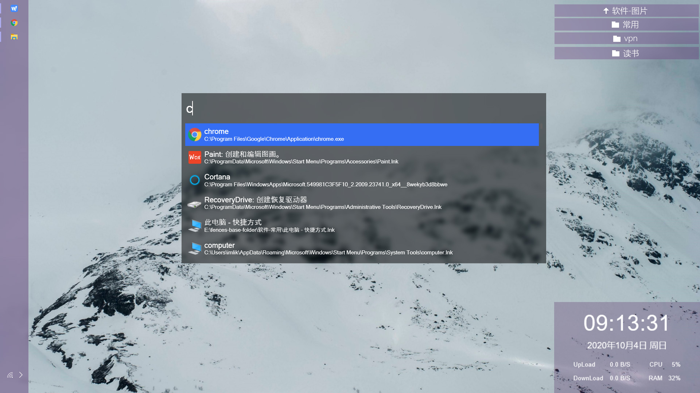
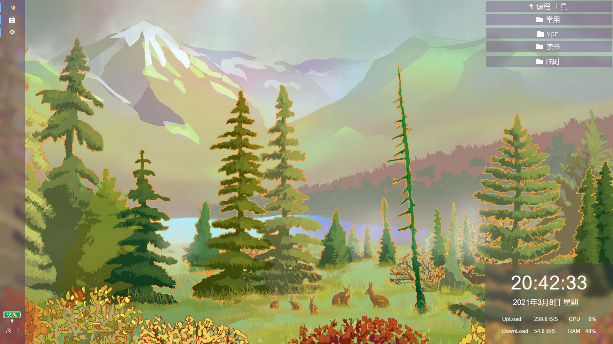

### simple-system-info

A Rainmeter skin, display system infomation: time, date, network, cpu, ram.

### preview

### usage

- Aero blur effect supports Windows 7 operating system, it will not work on Window 8.1 or Windows 10. So, if you want Aero blur effect on Windows 10, use [FrostedGlass](https://github.com/TheAzack9/FrostedGlass) plugin. Copy `FrostedGlass.dll` to Rainmeter plugins folder to enable [FrostedGlass](https://github.com/TheAzack9/FrostedGlass) plugin.
- Change the value of `bgcolor` under the `variables` section in source code, to match the skin color with your windows theme.
- Change the value of `Format` under the `MeasureDate` section in source code, if you don't satisfy the format of date.

### simple-system-info

Rainmeter 皮肤，显示系统信息：时间、日期、网速、cpu、ram。

### 预览

### 使用

- 模糊效果只能在win7上生效，不支持win8、win10。所以你如果想要模糊效果在win10上起作用，需要使用[FrostedGlass](https://github.com/TheAzack9/FrostedGlass)插件。复制`FrostedGlass.dll` 到 Rainmeter plugins 文件夹。
- 改变源码中`Variables`选项下面的`BgColor`的值，来使皮肤颜色和你的windows主题相搭配。
- 改变源码中`MeasureDate`选项下面的`Format`的值，如果你不满意日期的格式。

### 问题

如果中文乱码，请使用windows记事本程序保存SimpleSystemInfo.ini为ANSI格式。